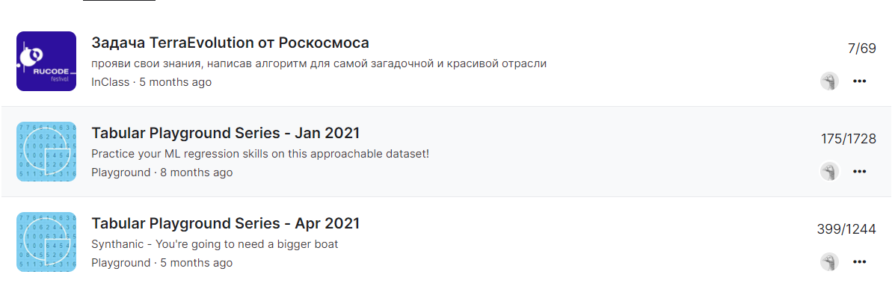
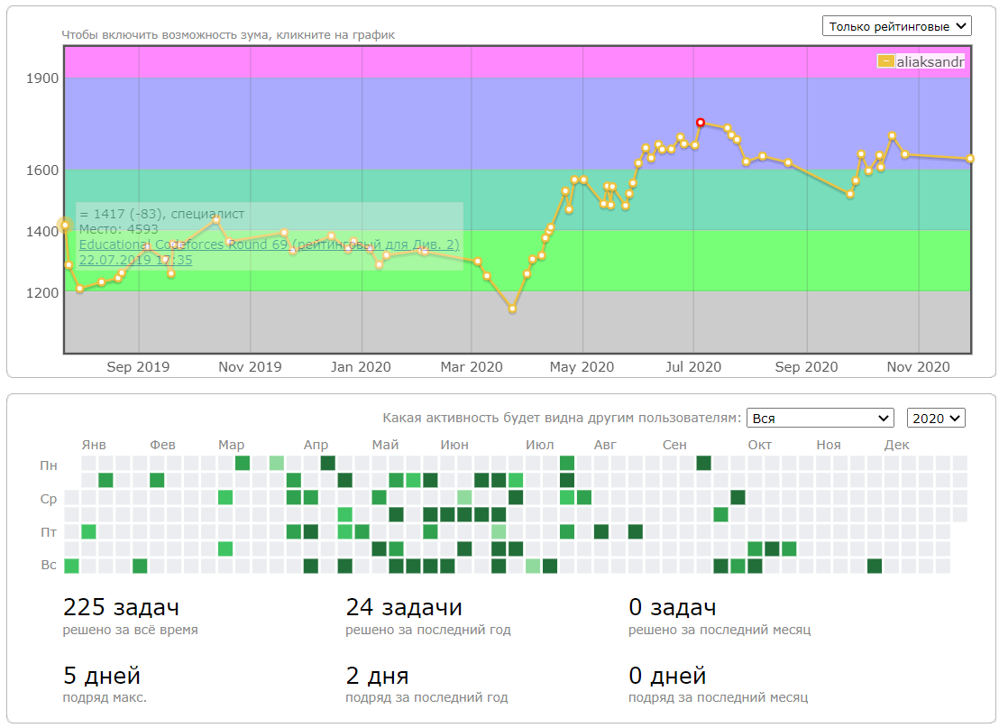

# Kukel Alexander
### _Contact information:_
**Phone number:** +375291915885
**Email:** aliaksandr.kukel@gmail.com

### _Education:_
**2014 – 2018 Belarusian State University**
***Chemistry Department***
Organic chemistry 
Bachelor’s degree
GPA 9.50 of 10

### _Experience:_
*07/2018 - present*
**Specialist**
**Center for Examinations and Tests in Health Service**
*Republican Clinical and Pharmacological Laboratory*
 - Development and validation of HPLC MS/MS methods for bioequivalence studies, impurity  analyzes and dissolution kinetics tests
 - Equipment maintenance and OQ qualification
 - Development of software for every day issues (data 
processing)

*09/2017 - 05/2018*
**Researcher**
**Institute of Bioorganic Chemistry**
*Laboratory of Steroid Chemistry*
- Research work in organic chemistry synthesis
- Instrumental confirmation of the structure of compounds of interest (NMR, IR, HPLC MS/MS

### _Skills:_
- English Intermediate (B1)
- Machine Learning & Data Science
- Python (NumPy, Seaborn, Pandas, Scikit-learn, PyTorch)
- C++ 
- SQL

### _Publications:_
-  https://doi.org/10.1039/C8CC00888D 
-  https://doi.org/10.1016/j.steroids.2019.03.010

### _Code example:_
**Isograms KATA from CODEWARS:** *An isogram is a word that has no repeating letters, consecutive or non-consecutive. Implement a function that determines whether a string that contains only letters is an isogram. Assume the empty string is an isogram. Ignore letter case.*
```sh
function isIsogram(str){
  return new Set(str.toLowerCase()).size == str.length;
}
```
### _Achievements:_
*02/2021*
***CompTech2021***
Result: https://github.com/comptech-winter-school/expasoft-adas (I was developing a model  for segmentation)

*01/2021*
**Kaggle: Tabular Playground Series - Jan 2021**
https://www.kaggle.com/aiexanderk


*2019 - present*
**Codeforces**
***Online programming contests, ITMO***
http://codeforces.com/profile/aliaksandr



### _Self-education:_
*2021*
**Deep Learning School (NLP)**
***Moscow Institute of Physics and Technology***
https://en.dlschool.org/

*2021*
**Service Now training**
***EPAM Training Center***

*2021*
**Basic course in data analysis**
***Yandex.Praktikum***
https://cat.2035.university/rall/course/305/?utm_source=dls&utm_medium=banner&utm_campaign=data-analyst

*2020*
**Deep Learning School (CV)**
***Moscow Institute of Physics and Technology***
https://en.dlschool.org/

*2020 - present*
**Open Machine Learning Course**
***Open Data Science***
https://mlcourse.ai/

*2020*
**Intro to Deep Learning with PyTorch**
***By Facebook AI***
https://www.udacity.com/course/deep-learning-pytorch--ud188

*07/2020*
**Machine Learning Course**
***Stanford University***
https://www.coursera.org/learn/machine-learning

*2020*
**Introduction to AI, Building AI**
***University of Helsinki***
https://www.elementsofai.com/

*2019*
**SQL sql-ex.ru training**